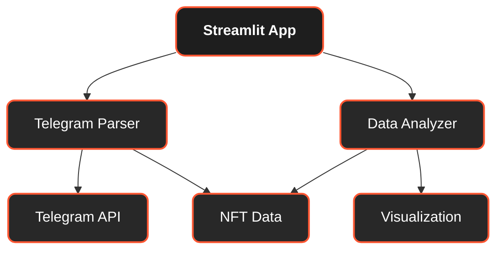
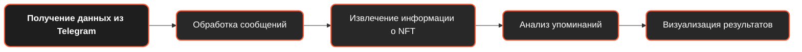
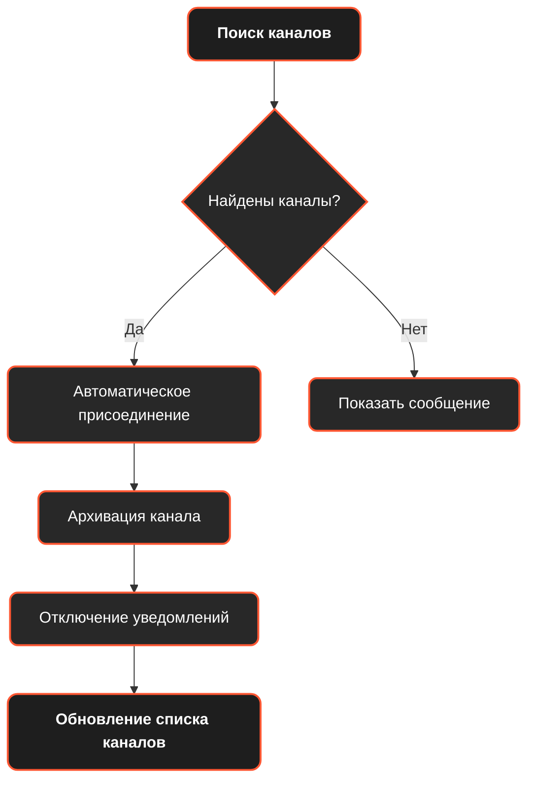

# NFT Analytics

Приложение для анализа и отслеживания NFT-проектов в Telegram-каналах.

## Описание

NFT Analytics - это инструмент для отслеживания и анализа NFT-проектов, упоминаемых в различных Telegram-каналах и группах. Приложение помогает пользователям быть в курсе последних трендов на рынке NFT, отслеживать популярные проекты и получать актуальную информацию для принятия инвестиционных решений.

## Возможности

| Функция | Описание |
|---------|----------|
| **Авторизация через Telegram** | Безопасный вход в приложение через API Telegram |
| **Автоматический поиск NFT-каналов** | Поиск и присоединение к каналам и группам, связанным с NFT |
| **Анализ упоминаний проектов** | Сбор и анализ данных о популярных NFT-проектах |
| **Визуализация данных** | Наглядные графики и таблицы для оценки трендов |
| **Управление подписками** | Управление списком отслеживаемых каналов, включая возможность массового отписывания |

## Архитектура проекта

## Как использовать

1. **Авторизация** - войдите в приложение с помощью номера телефона Telegram
2. **Поиск каналов** - используйте боковую панель для поиска NFT-каналов или просмотра ваших текущих подписок
3. **Выбор каналов** - выберите каналы из списка для анализа
4. **Обновление данных** - нажмите кнопку "Обновить данные" для получения актуальной информации
5. **Анализ результатов** - изучайте графики и таблицы с информацией о популярных NFT-проектах

## Технические детали

| Компонент | Описание |
|-----------|----------|
| **Python** | Основной язык разработки |
| **Streamlit** | Фреймворк для создания веб-интерфейса |
| **Telethon** | Библиотека для взаимодействия с API Telegram |
| **Pandas** | Библиотека для обработки данных |
| **Plotly** | Библиотека для построения интерактивных графиков |

## Процесс анализа данных

## Требования

Для работы с приложением необходимо:
1. API ключи Telegram (API ID и API Hash)
2. Авторизация через Telegram аккаунт

## Безопасность

Приложение использует официальное API Telegram и не хранит личные данные пользователей. Авторизация происходит напрямую через Telegram, а сессия хранится только на время использования приложения.

## Компоненты системы

| Файл | Назначение |
|------|------------|
| **app.py** | Основной файл приложения, содержащий интерфейс на Streamlit |
| **telegram_parser.py** | Модуль для взаимодействия с Telegram API |
| **data_analyzer.py** | Модуль для анализа и обработки данных |
| **auth.py** | Модуль для авторизации пользователя через Telegram |
| **utils.py** | Вспомогательные функции |

## Особенности работы с каналами

